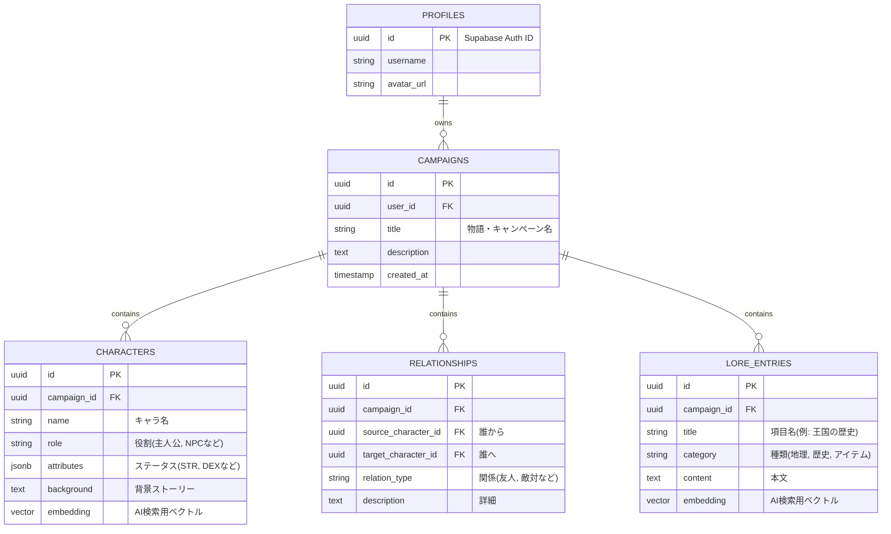

```mermaid
erDiagram
    PROFILES ||--o{ CAMPAIGNS : owns
    CAMPAIGNS ||--o{ CHARACTERS : contains
    CAMPAIGNS ||--o{ RELATIONSHIPS : contains
    CAMPAIGNS ||--o{ LORE_ENTRIES : contains

    PROFILES {
        uuid id PK "Supabase Auth ID"
        string username
        string avatar_url
    }

    CAMPAIGNS {
        uuid id PK
        uuid user_id FK
        string title "物語・キャンペーン名"
        text description
        timestamp created_at
    }

    CHARACTERS {
        uuid id PK
        uuid campaign_id FK
        string name "キャラ名"
        string role "役割(主人公, NPCなど)"
        jsonb attributes "ステータス(STR, DEXなど)"
        text background "背景ストーリー"
        vector embedding "AI検索用ベクトル"
    }

    RELATIONSHIPS {
        uuid id PK
        uuid campaign_id FK
        uuid source_character_id FK "誰から"
        uuid target_character_id FK "誰へ"
        string relation_type "関係(友人, 敵対など)"
        text description "詳細"
    }

    LORE_ENTRIES {
        uuid id PK
        uuid campaign_id FK
        string title "項目名(例: 王国の歴史)"
        string category "種類(地理, 歴史, アイテム)"
        text content "本文"
        vector embedding "AI検索用ベクトル"
    }
```